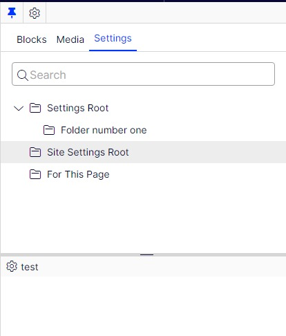

# AddOn.Episerver.Settings

[](https://msdn.microsoft.com/en-us/library/w0x726c2%28v=vs.110%29.aspx)
[](https://docs.microsoft.com/en-us/dotnet/)
[](https://docs.microsoft.com/en-us/dotnet/)
[](http://world.episerver.com/cms/)
[](http://world.episerver.com/cms/)
[](LICENSE)


## About
The Optimizely Settings addon makes it possible to work with different types of settings that are edititable in your Optimizely solution without the need for a deploy. It uses a code first approach based on the built in content model system with standard editors for property types including support for validation, versioning, multi-language etc. Settings can be both globally defined (a.k.a. for the entire solution) or defined for a sub-part of the page structure. The addon is available on Optimizelys nuget feed with versions for both Optimizely 11 and 12. Development of new functionality is currently mainly done for CMS 12+.

## Instructions

Settings can be defined either as global (for the entire solution) or created and assigned to a section of the content tree.

### Global Settings
Lets start with looking at how to work with global settings.

1. Create a settings type and make this a global setting by adding the SettingsContentType attribute.
The settings system will ensure that that this item is created at initialization if it does not already exist.
> You can use a [Resharper template](templates/SettingsTemplates.DotSettings)
```csharp
[SettingsContentType(AvailableInEditMode = false, GUID = "15506171-c6b2-4a7a-9c44-bb870f695911", SettingsInstanceGuid = "d8701e64-8206-4e24-bd3f-cb02b875d6c6", SettingsName = "Google Analytics")]
public class GoogleAnalyticsSettings : SettingsBase
{
    public virtual string UserName { get; set; }
}
```

If the settings needs properties to be localized, use the **LocalizableSettingsBase** class.
```csharp
[ContentType(GUID = "a5506171-c6b2-4a7a-9c44-bb870f695955")]
public class LocalizableMenuSettings : LocalizableSettingsBase
{
    [CultureSpecific]
    public virtual ContentReference MenuRoot { get; set; }
}
```

2. If you go into the editorial interface, in the main menu, under CMS, there should be an item "Global settings", where you can find the global settings items.
   


3. Getting the global settings in code
```csharp
ISettingsService settingsService = ServiceLocator.Current.GetInstance<ISettingsService>();
settingsService.GetSettings<GoogleAnalyticsSettings>();
```

### Local Settings

1. A local setting is basically the same as a global setting with the difference that you use the standard ContentType attribute instead of the SettingsContentType attribute.
> You can use a [Resharper template](templates/SettingsTemplates.DotSettings)
```csharp
[ContentType(GUID = "a5506171-c6b2-4a7a-9c44-bb870f695956")]
public class MenuSettings : SettingsBase
{
    public virtual ContentReference MenuRoot { get; set; }
}
```

2. Add a property to e.g the start page with a name matching the name of the settings type
```csharp
[UIHint("dynamicsettings")]
[AllowedTypes(new Type[] { typeof(MenuSettings) })]
[Display(GroupName = "SiteSettings")]
public virtual ContentReference MenuSettings { get; set; }
```

3. Settings are created in a gadget in the side bar, just as you would work with blocks:


Once you have created your setting you can assign the value of your page property to connect them.

### Combining local and global settings

You can even combine local settings with global settings where the global setting will be used as a fallback if there are no local settings defined in the requested content hierarchy. If you want to try this, you can do the following:
* Go into the adminstrative interface and change the GoogleAnalyticsSettings content type to allow creation in edit mode.
* Go into the settings gadget in the editorial view and create a GoogleAnalyticsSettings setting.
* Add this property to a page type:
```csharp
[UIHint("dynamicsettings")]
[AllowedTypes(new Type[] { typeof(GoogleAnalyticsSettings) })]
[Display(GroupName = "SiteSettings)]
public virtual ContentReference GoogleAnalyticsSettings { get; set; }
```
* Assign the value of the property to the setting you created in the local settings.
* After you have done this, content under the node that has assigned the local setting should get these settings, while content outside of this structure should get the global settings.

## Site specific settings
*From version 3:* If "Use site specific assets" is enabled for a site, a "Site settings Root" folder is created for each site where settings for the site can be stored.



If upgrading from version 2 *AND* and sites in the solution has had site specific assets enabled.

1. Upgrade to version 3.x
2. Using the blocks gadget, locate the folder "For this site / Settings Root"
3. Move it into "For all sites / Settings Root"
4. Now all settings are available in the settings gadget so that they can be moved into the specific site they target (or being kept as shared)

## Getting a setting
To get a settings instance from your code you use the ISettingsService. It has a number of methods for resolving settings depending on the need.

```csharp
ISettingsService settingsService = ServiceLocator.Current.GetInstance<ISettingsService>();

// Will resolve the first menuSetting found, starting from the current content context
settingsService.GetSetting<MenuSettings>();

// Will resolve the first menuSetting found, starting from the provided content reference
settingsService.GetSetting<MenuSettings>(myContentReference);

// Will resolve the first menuSetting found, starting from the provided content
settingsService.GetSetting<MenuSettings>(myContentInstance);

// Will resolve a menuSetting only from the global settings
settingsService.GetGlobalSetting<MenuSettings>();

// Will resolve all menuSettings found, starting from the provided content reference
settingsService.GetSettingsRecursive<MenuSettings>(myContentReference);

// Will resolve all menuSettings found, starting from the provided content
settingsService.GetSettingsRecursive<MenuSettings>(myContentInstance);
```

The default settings resolver will traverse the structure and look for properties with the same name as the settings type, in this case "MenuSettings", and return the first property with a defined value. Since the settings are matched by name - you can implement settings across content types.

If you want to clarify that a content types is a source of a certain type of settings - you can create your own interface to declare this. However, this is not something that the settings system will use.

## Customize how settings are resolved
By default, settings are resolved by searching for properties with name matching the Settings type. If you wish to add a custom way for this, it is possible to add a class implementing __ISettingsResolver__. For example this gives the power to have nested settings.

The registered resolvers are ordered by the SortOrder property and will be called for each IContent item traversed. The first resolver that returns a setting will "win" and that setting will be the on used.

Implement a class:
```csharp
public class CustomSettingsResolver : ISettingsResolver
{
    public int SortOrder => 1;
    
    public bool TryResolveSettingFromContent<T>(IContent content, out T setting) where T : SettingsBase
    {
        // Add suitable logic to get the correct settings-instance 
    }
}
```

Register it in the di-container:
```csharp
services.AddSingleton<ISettingsResolver, CustomSettingsResolver>();
```

## Requirements

* Episerver CMS >= 11.20.7
* .Net 4.8 or .NET6+
